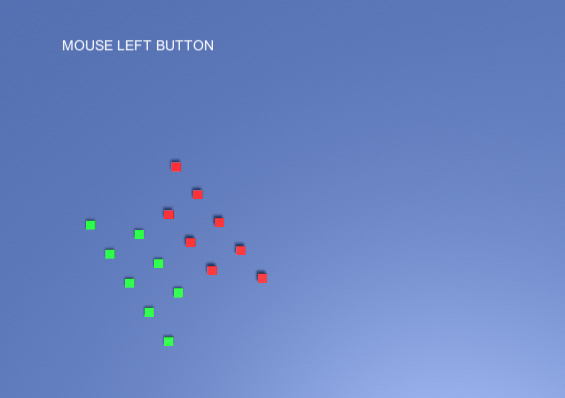

# Formation

Squad의 대형을 유지하면서 도착지점들을 구성하고,

Squad에 소속된 Unit의 적절한 도착지점을 분배하여, 해당 지점으로 Unit들을 이동시키고자 합니다.

</img>

## Youtube

https://youtu.be/XXXX

## Compile

Unity 2020.3.2f1 를 기반으로 컴파일되도록 작성하였습니다.

## Description

- 크로스파이어 : RTS 전투모드에서 병사와 탱크의 Squad 이동을 위한 Formation 을 형성하는 도착지점 분배 알고리즘에 사용하는 방식입니다.

( 실제 크로스파이어 전투엔진은 C++ 으로 구성되어져 있읍니다. )
